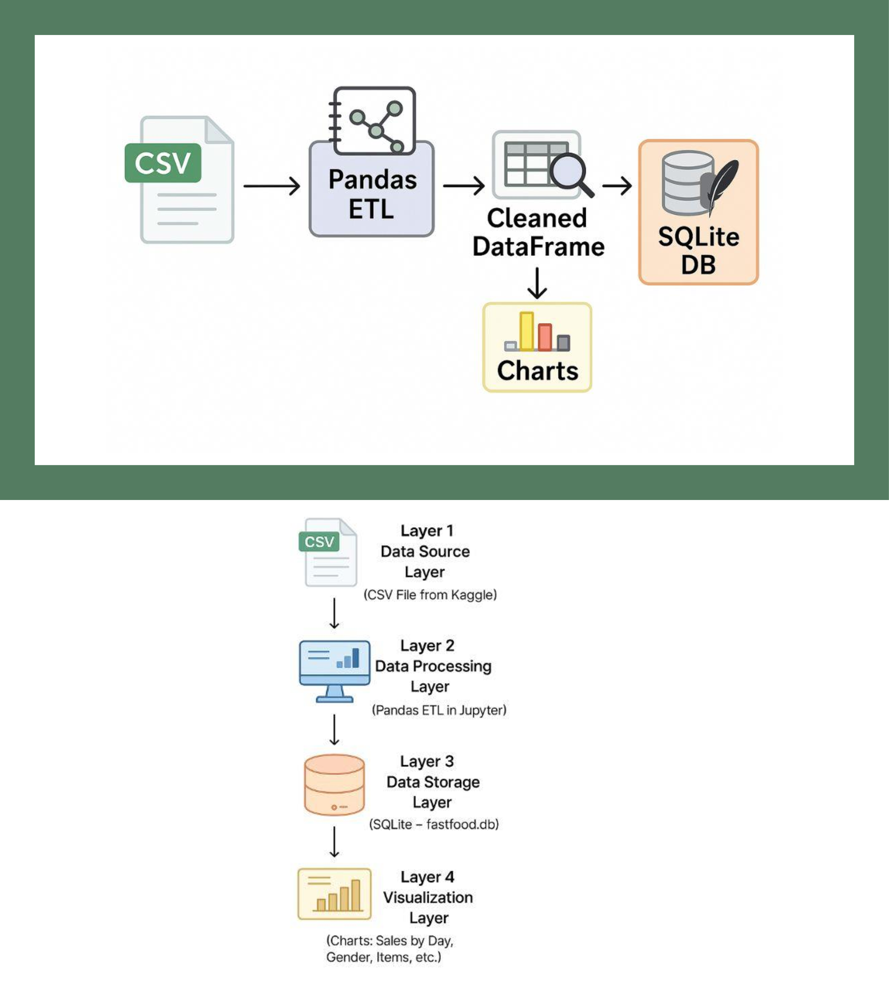

# Daily Fastfood Sales Analysis

A data pipeline to analyze daily fast-food customer sales, generate insights, and visualize trends using Python, SQLite, and Jupyter.

## How to Run
1. Clone the repo  
2. Install dependencies: `pip install -r requirements.txt`  
3. Start Jupyter: `jupyter notebook`  
4. Open `notebooks/etl_analysis.ipynb`  

## Visualizations
- Total sales by outlet  
- Sales by day and hour  
- Top 10 ordered items  
- Order type distribution by gender  

## Architecture


## Tools Used
- Python (Pandas, Matplotlib, Seaborn)  
- SQLite  
- Jupyter Notebook  

## Email Alerts Setup

To enable email notifications for ETL pipeline success/failure, configure your environment variables in the `.env` file located in the project root:

EMAIL_SERVER=smtp.gmail.com
EMAIL_PORT=587
EMAIL_USER=abhilashnadesan66@gmail.com
EMAIL_PASS=uhffsuavjrzycgpa
EMAIL_TO=abhilashnadesan66@gmail.com,another@example.com

**Note:** Use an App Password for `EMAIL_PASS` if using Gmail with 2FA enabled.

### Testing Email Notifications

You can test sending an email alert by running the following command in your project directory:

```bash
python3 email_notifier.py "Test Alert" "This is a test email from the fastfood ETL pipeline."

Just **replace the placeholder emails and passwords** with your real info in `.env`, and add this full README.md text to your README file.

Want me to help you save this as a file?


# Daily Fastfood Sales Analysis

## Data Pipeline Architecture


**Key Layers:**
1. **Data Source**: CSV files from Kaggle
2. **Processing**: Pandas ETL
3. **Storage**: SQLite (sales_data.db)
4. **Automation**: Cron/Airflow (with email alerts)
5. **Visualization**: Matplotlib/Seaborn
6. **Containerization**: Docker
7. **Deployment**: GitHub Pages/Streamlit
