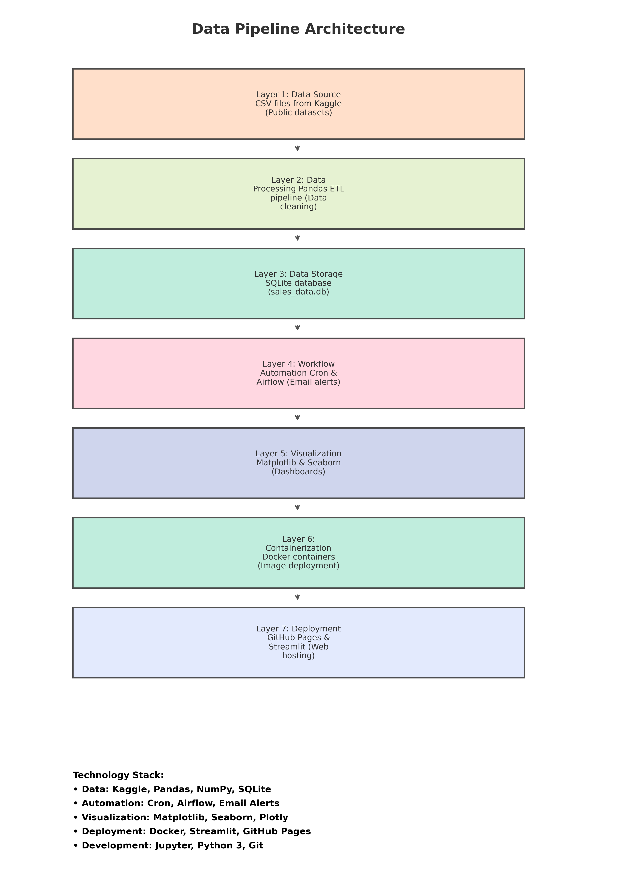

# Daily Fastfood Sales Analysis

“The project uses fast food sales data to analyze customer behavior by time of day, gender, and item popularity. It helps a fast food chain understand peak sales hours, best-selling items, and preferred order types for each demographic segment.”

 

## Data Pipeline Architecture


**Key Layers:**
1. **Data Source**: CSV files from Kaggle
2. **Processing**: Pandas ETL
3. **Storage**: SQLite (sales_data.db)
4. **Automation**: Cron/Airflow (with email alerts)
5. **Visualization**: Matplotlib/Seaborn
6. **Containerization**: Docker
7. **Deployment**: GitHub Pages/Streamlit
8. **Machine Learning Model:** A simple classification model built with Python (Random Forest).

## Email Alerts Setup

To enable email notifications for ETL pipeline success/failure, configure your environment variables in the `.env` file located in the project root:

EMAIL_SERVER=smtp.gmail.com
EMAIL_PORT=587
EMAIL_USER=abhilashnadesan66@gmail.com
EMAIL_PASS=xxxxxxxxxx
EMAIL_TO=abhilashnadesan66@gmail.com

**Note:** Use an App Password for `EMAIL_PASS` if using Gmail with 2FA enabled.


# Step-by-Step Guide

## Project Directory Setup
cd "/Users/jenniferabhilash/Desktop/EUBS/Third Semester/daily fastfood project"
 
## Section 1: Load the Raw Data
```python
import pandas as pd
file_path = "data/raw/sales_data.csv"
df = pd.read_csv(file_path)
print("Shape of data:", df.shape)
print(df.head())
```
"This loads our sales dataset with all the raw customer orders."
 
 ## Section 2: Data Cleaning and Feature Engineering
```python
df = df.drop(columns=["unnamed:_5", "unnamed:_6"], errors='ignore')
df.columns = [col.strip().lower().replace(" ", "_") for col in df.columns]
df = df.dropna()
df = df.rename(columns={'ordereditem': 'item'})
when_to_hour = {'Morning': 9, 'Afternoon': 14, 'Evening': 18, 'Night': 21}
df['hour'] = df['when'].map(when_to_hour)
df['date'] = pd.to_datetime("2025-05-01")
df['day_of_week'] = df['date'].dt.day_name()
df['sale'] = 1
print(df.head())
```
"We removed junk columns, fixed names, filled time info, and added extra fields."
 
## Section 3: Store Cleaned Data in SQLite Database
``` python
import sqlite3
db_path = "db/sales_data.db"
conn = sqlite3.connect(db_path)
df.to_sql("fastfood_sales", conn, if_exists="replace", index=False)
conn.close()
print("Data saved to SQLite.")
```
 "Now we store the cleaned data into a database for reuse."
 
## Section 4: Visualizations
A. Items Ordered by Time of Day
```python
item_when = df.groupby(['when', 'item']).size().unstack().fillna(0)
item_when.plot(kind='bar', stacked=True, colormap='tab20', figsize=(12, 6))
plt.title("Items Ordered by Time of Day")
plt.ylabel("Number of Orders")
plt.xlabel("Time of Day")
plt.xticks(rotation=0)
plt.tight_layout()
plt.savefig("visuals/items_by_time_of_day.png")
plt.show()
```
B. Sales by Time of Day
```python
sales_by_period = df.groupby('when')['sale'].sum()
sales_by_period.plot(kind='bar', color='lightgreen', figsize=(8, 5))
plt.title('Sales by Time of Day')
plt.xlabel('Time of Day')
plt.ylabel('Number of Sales')
plt.xticks(rotation=45)
plt.tight_layout()
plt.savefig("visuals/sales_by_time_of_day.png")
plt.show()
```
C. Order Type by Gender
```python
df['gender_label'] = df['gender'].map({1.0: 'Male', 0.0: 'Female'})
order_type_by_gender = df.groupby(['order_type', 'gender_label']).size().unstack().fillna(0)
order_type_by_gender.plot(kind='bar', figsize=(8, 5), colormap='viridis')
plt.title("Order Type Distribution by Gender")
plt.xlabel("Order Type")
plt.ylabel("Number of Orders")
plt.xticks(rotation=45)
plt.tight_layout()
plt.savefig("visuals/order_type_by_gender.png")
plt.show()
```
D. Top 10 Items
```python
top_items = df['item'].value_counts().head(10)
top_items.plot(kind='bar', color='teal', figsize=(10, 6))
plt.title('Top 10 Most Ordered Items')
plt.xlabel('Item')
plt.ylabel('Number of Orders')
plt.xticks(rotation=45)
plt.tight_layout()
plt.savefig("visuals/top_10_items.png")
plt.show()
```
"These plots help us understand what sells when, who orders how, and what’s most popular."
 
## Section 5: Streamlit Web App + API
Step 1: Run the Flask API
```bash
python3 mock_api.py
Expected Output in Terminal:
 * Running on http://127.0.0.1:5000/
Test in Browser: Open http://127.0.0.1:5000/data to see the raw JSON output. This shows all sales in a format your Streamlit app can use.
mock_api.py example:
```
```python
from flask import Flask, jsonify
import pandas as pd

app = Flask(__name__)

@app.route("/data")
def get_data():
    df = pd.read_csv("data/processed/sales_cleaned.csv")
    return df.to_json(orient="records")

if __name__ == "__main__":
    app.run(debug=True)
```
Step 2: Run the Streamlit App
```python
streamlit run streamlit_app.py
Inside streamlit_app.py it fetches API data like this:
import requests
import pandas as pd

response = requests.get("http://localhost:5000/data")
data = pd.DataFrame(response.json())
```

"This app connects to the API running on my computer. It loads live sales data and lets me filter by Online (0) or In-Person (1). Also, 0 means Female and 1 means Male in the gender column.
Example 1: If I filter by 'Online' and 'Male', I can check how many male customers ordered online. Example 2: I can also filter for time — like seeing which gender orders more in the evening.
This helps non-technical users explore data easily."
 
## Section 6: Automation + Email Alerts
A. Run Pipeline Manually
```python
bash run_pipeline.sh
run_pipeline.sh:
#!/bin/bash
cd "/Users/jenniferabhilash/Desktop/EUBS/Third Semester/daily fastfood project"
python3 etl_analysis.py
python3 email_notifier.py "Pipeline completed successfully" "ETL job finished at $(date)"
```
B. Set up Cron Job (runs every hour)
```python
crontab -e
```
Add this:
0 * * * * /Users/jenniferabhilash/Desktop/EUBS/Third Semester/daily fastfood project/run_pipeline.sh >> /Users/jenniferabhilash/Desktop/EUBS/Third Semester/daily fastfood project/logs/pipeline.log 2>&1
C. Test the Email Alert Manually
python3 email_notifier.py "Test Subject" "Test Body"
 This sends a test email to confirm email settings are working.

## "My pipeline runs every hour — at 0 minutes of every hour. After the ETL job completes, an email is sent with success status. If something goes wrong, I’ll get a failure alert.
Example: At 3:00 PM, the job runs. If it works, I get 'Pipeline Completed Successfully'. If not, I get 'Pipeline Failed' with the error message. This helps monitor everything even if I'm not around."
 
## Section 7: Machine Learning Model
python ml_model.py
Output:
Model Accuracy: 1.00
Predictions: [1 0 0]
Actual:      [1 0 0]

"This model predicts how a customer will order: 0 = Online, 1 = In-Person. It uses only two things: gender and hour of the day.
For example:
•	A male (1) at 6PM (hour=18) is predicted to order In-Person (1).
•	A female (0) at 10AM (hour=10) might be predicted as Online (0).
This is useful if the company wants to prepare stock differently for morning vs night orders or plan staff based on behavior. The model performed very well with 100% accuracy in the test data."
 
## Section 8: Docker Container
```python
docker build -t fastfood-pipeline -f Dockerfile .
docker run -it --rm fastfood-pipeline
```
 "Docker lets me run this project anywhere, without setup problems. Everything runs inside a container."
 
## Section 9: Airflow UI and DAG
airflow webserver --port 8080
•	Open browser: http://localhost:8080
•	Log in using: admin / admin
Then run:
airflow scheduler
•	DAG fastfood_sales will appear in the list.
•	Toggle it ON to activate daily run.
"This gives a visual interface for managing the pipeline. I can turn it on, check logs, and run manually from the Airflow dashboard."
 
## Section 10: Deployment to GitHub + Streamlit Cloud
•	Code pushed to GitHub repo ✅
•	Visuals and notebook added
•	Streamlit Cloud used to host the app online

"I deployed my project to GitHub and also hosted my dashboard using Streamlit Cloud. This makes it public and accessible to my professor or team."
 


